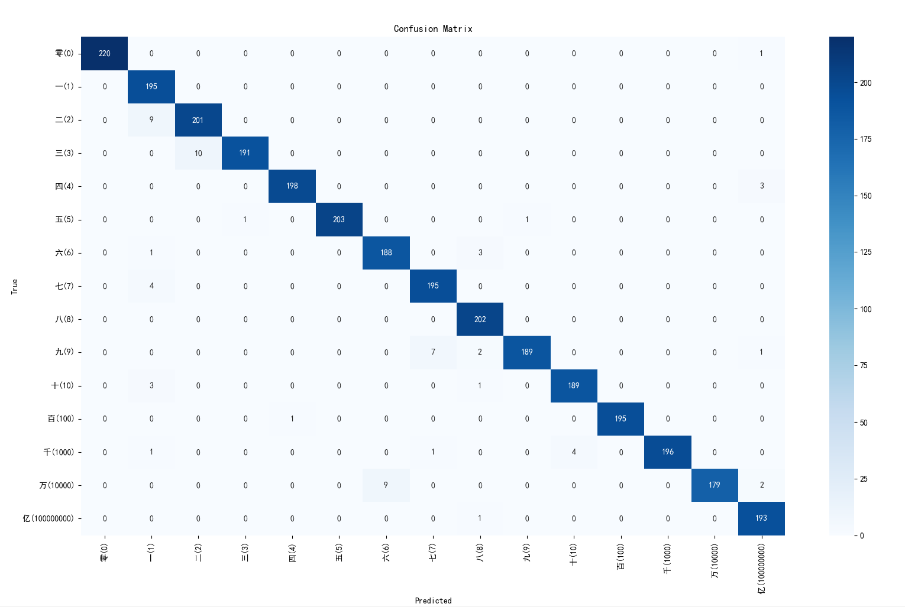
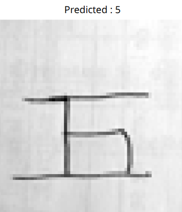

# ChineseNumbersRecognition

Making from scratch a deep learning model trained to recognize handwritten Chinese characters.
Used the dataset https://www.kaggle.com/datasets/gpreda/chinese-mnist for the 15 000 characters used for the training.

My goal was to train a model and to make it recognize the character that I handwrite

The file chineseNumbersRecognitionModel is set to be run and do everything from downloading the dataset, initializing the model that is in the NeuralNetwork.py file,to train it with the trainModel.py file and finally display a confusion matrix and save it.

The confusion matrix of my model on the test data

The model prediction on the number 5 that I wrote
